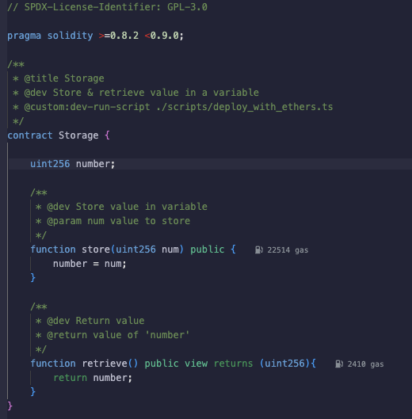
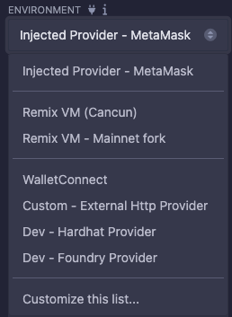
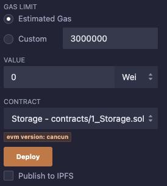
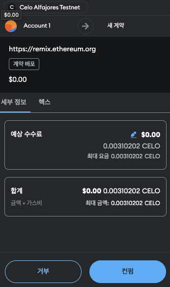
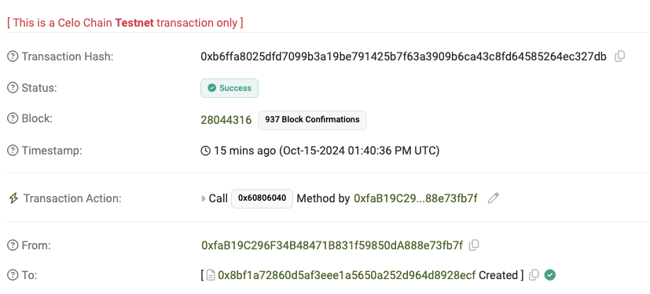

## Example-01: Storage.sol in Ethereum Remix IDE

1) Access Remix IDE and compile the code (Storage.sol)

    

2) Compile the code and select the "Injected Provider" in the Environment

    

3) Deploy the contract

    

4) Click the "Confirm" button in the MetaMask

    

5) Check the contract address in explorer

    

